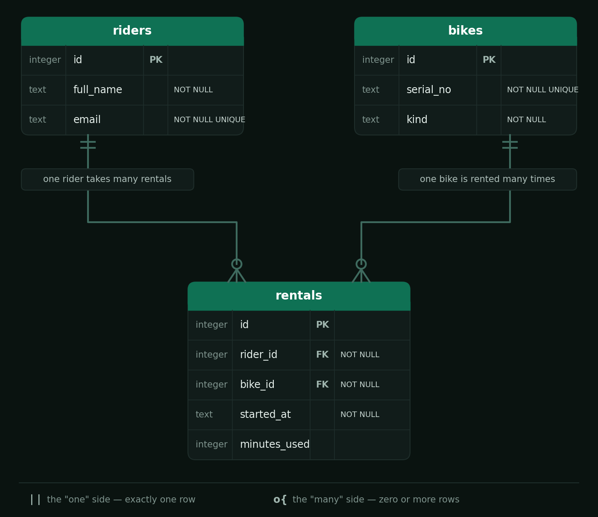

# Summative Assessment

## Learning Outcomes

| Learning Outcome | Section |
|---|---|
| Agile Methodology | Section 1 |
| Build Pipelines / Scripting | Section 2 |
| OOP | Section 3 |
| Brownfields Development | Section 4 |
| Testing | Section 5 |
| Systems Design | Section 6 |
| Relational Databases | Section 7 |
| WebDev | Section 8 |

---

## Duration

**Total time: 3 hours 30 minutes**

| Section | Recommended Time |
|---|---|
| Section 1 — Agile Methodology | 20 minutes |
| Section 2 — Build Pipelines and Scripting | 30 minutes |
| Section 3 — OOP | 25 minutes |
| Section 4 — Brownfields Development | 30 minutes |
| Section 5 — Testing | 25 minutes |
| Section 6 — Systems Design | 10 minutes |
| Section 7 — Relational Databases | 30 minutes |
| Section 8 — WebDev | 40 minutes |

---

## Scoring

| Section | Marks |
|---|---|
| Section 1 — Agile Methodology | 12 |
| Section 2 — Build Pipelines and Scripting | 14 |
| Section 3 — OOP | 12 |
| Section 4 — Brownfields Development | 14 |
| Section 5 — Testing | 14 |
| Section 6 — Systems Design | 8 |
| Section 7 — Relational Databases | 13 |
| Section 8 — WebDev | 13 |
| **Total** | **100** |

---

## Before you start

You have joined **RideHub**, a small team building a city bike-share service. You have
inherited an existing Java codebase (`src/`). Every section below is about this one
product.

**The project does not compile when you receive it.** Two problems stop the build:
a missing dependency (**Q2.3**) and a broken class structure (**Q3.1**). Fix those two
first, in any order. After that the sections can be completed in any order, and most of
the tests will start running (some are *supposed* to fail until you finish their task).

How to submit:

- Written answers go in `answers.txt`, under the matching question heading. Do not
  change the format of the file or create a new one.
- Code answers go in the files named in each task.
- Unless a task says otherwise, **you may not modify any file in `src/test/`**.

---

# Section 1 — Agile Methodology

## Scenario

RideHub's previous product was built the traditional way. Requirements were written and
signed off in month 1, design happened in month 2, coding in months 3 to 6, and testing
in month 7. At launch, riders discovered that the app could not unlock a bike on a weak
mobile signal, something nobody could have spotted from a requirements document.

The founders want to change the way the team works before the next version is built,
which adds electric and cargo bikes. You have been made delivery lead and your first
responsibility is to set the team's way of working.

| Task | Marks | What earns marks |
|---|---|---|
| Q1.1 — Waterfall vs Agile | 4 | Accurate definition of both (2), explains how time-boxed iterations would have caught the launch problem in this scenario (2) |
| Q1.2 — The taskboard | 4 | Lanes cover the full journey from backlog to delivered and are in a sensible order (2), every lane says what has to be true before work leaves it (2) |
| Q1.3 — Tickets and user stories | 4 | Both stories use the correct format with the right actor and goal (2), acceptance criteria are specific, testable and in Given / When / Then form (2) |

---

### Q1.1 — Waterfall vs Agile *(4 marks)*

Define the Waterfall model and Agile (time-boxed) delivery. Explain how working in
short time-boxed iterations would have exposed the weak-signal problem earlier than
the team's previous approach did.

---

### Q1.2 — The Taskboard *(4 marks)*

Design the lanes for the team's GitLab issue board so that, together, they show the
full journey of a piece of work from an idea in the backlog to something delivered to
riders.

Record your lanes in `answers.txt`, from left to right. For each lane, write one line
saying what must be true before a ticket is allowed to leave it. If you also build the
board in GitLab, do not leave GitLab's default *Open* and *Closed* columns on it. They
do not count as lanes.

---

### Q1.3 — Tickets and User Stories *(4 marks)*

Write up two tickets for the next sprint:

- **Ticket 1:** Rent a bike
- **Ticket 2:** Report a damaged bike

For each ticket write a user story from the user's perspective (*As a … I want … so
that …*) and **two** acceptance criteria in *Given / When / Then* form.

---

# Section 2 — Build Pipelines and Scripting

| Task | Marks | What earns marks |
|---|---|---|
| Q2.1 — Continuous integration | 3 | Correct definition (1), explains why tests run before packaging and what a failing stage should do (1), gives two things a pipeline provides that "run the tests when you remember" does not (1) |
| Q2.2 — Versioning a release | 3 | Correct version number and sound reason for **(a)** (1), **(b)** (1) and **(c)** (1) |
| Q2.3 — Fix the build | 3 | Correct Maven Central coordinates (2), placed in `pom.xml` with the correct scope, and — with Q3.1 also complete — `make package` succeeds (1) |
| Q2.4 — Build a pipeline | 3 | Correct `stages` in the correct order and `test` job in its own stage (1), `test` job runs the matching Makefile target and publishes the JUnit report (1), `package` job runs the matching target, keeps the jar as an artifact and only runs on the default branch (1) |
| Q2.5 — A release script | 2 | Stops on the first failure and rejects a missing or malformed version (1), runs the steps in the correct order and reports the result (1) |

---

### Q2.1 — Continuous Integration *(3 marks)*

A teammate merged a change to `main` that broke several tests. Nobody noticed until
the demo on Friday. Define **continuous integration**. Explain why a pipeline runs the
tests *before* it packages the application, and what should happen to the later stages
when the tests fail. Give **two** things a shared pipeline gives the team that "every
developer runs the tests when they remember to" does not.

---

### Q2.2 — Versioning a Release *(3 marks)*

RideHub's API is currently released as version `3.2.0`, and the team uses semantic
versioning.

Each of the following changes is made **independently**, starting from `3.2.0` in every
case. For each one, state the new version number and explain why:

- **(a)** You fix a bug where `FareCalculator` rounds a fare incorrectly. No method
  signatures change.
- **(b)** You add an optional query parameter `?type=ELECTRIC` to `GET /api/bikes`.
  Every existing request still works exactly as before.
- **(c)** You rename the JSON field `serialNo` to `serial_number` in every response.

---

### Q2.3 — Fix the Build *(3 marks)*

The web code in this project uses a library that is not declared in `pom.xml`, so the
project cannot compile. Find the missing dependency and add it to `pom.xml` so that
`make package` succeeds and produces a runnable jar.

> You can search for artefacts on [Maven Central](https://mvnrepository.com/repos/central).
>
> `pom.xml` marks the spot. Read the build output carefully too, because it names what
> it cannot find. The code is written against the **6.x** line of this library. A
> different major version will not compile.
>
> Look at how the dependencies that are already declared use `scope`.

---

### Q2.4 — Build a Pipeline *(3 marks)*

This project builds using GitLab CI. The pipeline is defined in `.gitlab-ci.yml` and
runs against the same `Makefile` targets you use locally: `make compile`, `make test`
and `make package`.

The image and the `compile` job are provided as a worked example. Define the `stages`
for this pipeline, and add a job for each remaining stage, so that once pushed the
pipeline compiles the code, runs the test suite, and then packages the application.

Your pipeline must:

- publish the Surefire test results (`target/surefire-reports/TEST-*.xml`) as a JUnit
  report, **even when tests fail**;
- keep the packaged jar (`target/ridehub-jar-with-dependencies.jar`) as a pipeline
  artifact;
- only run the packaging job on the project's **default branch**.

> You are allowed to use the following [CI/CD docs](https://docs.gitlab.com/ci/yaml/).

---

### Q2.5 — A Release Script *(2 marks)*

Complete `scripts/release.sh`. It is run from anywhere as:

```bash
./scripts/release.sh 1.4.0
```

It must:

1. Stop immediately if any command fails or an unset variable is used.
2. Print a usage message to **standard error** and exit with a non-zero status if the
   version is missing or is not of the form `MAJOR.MINOR.PATCH` (digits only).
3. Run `make test` and then `make package`, from the project root. If the tests fail,
   nothing may be packaged.
4. Copy the built jar to `dist/ridehub-<version>.jar` and print
   `Released <version>: dist/ridehub-<version>.jar`.

---

# Section 3 — OOP

## Scenario

Every bike in RideHub charges an unlock fee and a price per minute, but each kind of
bike charges differently. `StandardBike` and `ElectricBike` are fully implemented.
`Bike` holds what every bike shares.

| Task | Marks | What earns marks |
|---|---|---|
| Q3.1 — Fix the class structure | 3 | Correctly identifies why `Bike` does not compile (1), restores it as an abstract class, leaving the two abstract method declarations untouched (1), stops `serialNo` being publicly accessible (1) |
| Q3.2 — Implement `CargoBike` | 5 | Extends `Bike` and keeps the load capacity (1), correct unlock fee and price per minute (2), rejects a load capacity of zero or less with the right exception (1), all `CargoBikeTest` tests pass (1) |
| Q3.3 — Polymorphism | 4 | Explains how `Fleet.totalCostFor` works without knowing the kind of bike (2), explains what changes in `Fleet` when `CargoBike` is added and why (1), names the principle that the design follows (1) |

---

### Q3.1 — Fix the Class Structure *(3 marks)*

`Bike` is meant to be an abstraction. It holds the state and behaviour every bike
shares, but it cannot work out an unlock fee or a price per minute on its own. Only its
subclasses can, and each does it differently. As it stands, `Bike` does not compile,
and it has a second, quieter problem with how it protects its own data.

Analyse `Bike` and fix both problems. Leave the two abstract method declarations as
they are, and do not change any pricing logic in the subclasses. In `answers.txt`,
explain why the class did not compile.

> `BikeTest` describes the structure the class should have.

---

### Q3.2 — Implement `CargoBike` *(5 marks)*

Implement `CargoBike` (the signatures are already there; the bodies are placeholders):

| | |
|---|---|
| Unlock fee | R8.00 |
| Price per minute | R1.25 |
| Load capacity | Given in whole kilograms in the constructor and returned by `getLoadCapacityKg()`. A capacity of zero or less is not valid and must throw `IllegalArgumentException` |

Run `mvn test` to check your work against `CargoBikeTest`.

---

### Q3.3 — Polymorphism *(4 marks)*

Look at `Fleet.totalCostFor(int minutes)`. It adds up the trip cost of every bike in
the fleet.

1. Explain how this method can work out a cost for every bike **without knowing which
   kind of bike it is holding**.
2. Once `CargoBike` exists, what has to change in `Fleet` for cargo bikes to be
   included in the total, and why?
3. Name the OOP principle that makes this possible.

---

# Section 4 — Brownfields Development

| Task | Marks | What earns marks |
|---|---|---|
| Q4.1 — Brownfield vs Greenfield | 2 | Accurate contrast (1), a genuine example from a project you have worked on (1) |
| Q4.2 — Refactoring | 2 | Correct definition and what must stay true before, during and after (1), clear refactor-vs-rewrite distinction (1) |
| Q4.3 — Refactoring for maintainability | 10 | Split across two methods, 5 each: the specific problem is identified and why it matters is explained (2), the refactor resolves it and all existing tests pass unmodified (2), the written justification is specific to your change (1) |

---

### Q4.1 — Brownfield vs Greenfield *(2 marks)*

Define and contrast brownfield and greenfield software development. What makes a
project a brownfield project? Use a specific example from a project you have worked on
(for example Robot Worlds) to illustrate your answer.

---

### Q4.2 — Refactoring *(2 marks)*

Define refactoring. State what must stay true before, during and after a refactor, and
explain why refactoring is treated differently from a rewrite.

---

### Q4.3 — Refactoring for Maintainability *(10 marks)*

Somewhere in the `rentals` package there are **two methods**, each with a *different*
maintainability problem in how its conditional logic is written. For each method,
complete all three steps.

#### Q4.3.1 — Locate and describe the problem

Name the class and method. Explain in your own words what is wrong with how the logic
is structured and why it matters for readability, testability or safe modification.
*(Write this in `answers.txt`.)*

#### Q4.3.2 — Refactor

Refactor the method to resolve the problem you identified. Its behaviour, including
its return values and the exceptions it throws, must not change.

#### Q4.3.3 — Prove behaviour preservation

Run the existing test suite before and after your refactor:

```bash
mvn test
```

Your refactored code must pass all existing tests **unchanged**. You may not modify
the tests to make them pass. In `answers.txt`, write **3 to 5 sentences** per method
justifying why your new structure is more maintainable than the original.

---

# Section 5 — Testing

| Task | Marks | What earns marks |
|---|---|---|
| Q5.1 — Types of testing | 5 | Each of the three tests classified correctly and what it checks is explained (3), when in development each happens (1), which type there should be most of and why (1) |
| Q5.2 — Test reports | 3 | Reads the report correctly (1), explains why a low number of tests weakens "all tests passed" (1), explains the value of a report over time (1) |
| Q5.3 — Write unit tests | 6 | At least six additional, passing, meaningful tests (2), boundary values tested on both sides (2), invalid input and the upper limit tested (1), tests are independent, clearly named and check one behaviour each (1) |

---

### Q5.1 — Types of Testing *(5 marks)*

Here are three tests the RideHub team could write:

- **A.** A test that creates an `ElectricBike` and asserts that `pricePerMinute()`
  returns `1.50`.
- **B.** A test that starts the web application on a random port, sends
  `POST /api/rentals` for bike `SB-001`, then sends `GET /api/bikes/SB-001` and asserts
  that `available` is now `false`.
- **C.** A scenario agreed with the product owner *before any code is written*: "Given a
  verified rider with enough credit, when they rent an available bike, then the bike is
  no longer shown as available and the rider is told the unlock fee."

For each, say whether it is a **unit**, **integration** or **acceptance** test and
explain what it is checking (a single method or class, how components work together,
or the behaviour of the system as a whole). Then explain roughly when in development
each kind of test is written or run, and which kind a healthy test suite should contain
the most of, and why.

---

### Q5.2 — Test Reports *(3 marks)*

After a build, the team's pipeline shows this Surefire summary:

```
[INFO] Results:
[WARNING] Tests run: 41, Failures: 0, Errors: 0, Skipped: 9
[INFO] BUILD SUCCESS
```

Is it safe to conclude that the code works? Explain what the report does and does not
tell you, what it would suggest if the number of tests run were very low for the size
of the codebase, and why it is useful to look at test reports across many runs rather
than only the latest one.

---

### Q5.3 — Write Unit Tests *(6 marks)*

`LateReturnPenalty` works out the penalty for a bike that is returned late. Its rules
are:

| Minutes overdue | Penalty |
|---|---|
| Negative | Not valid: throws `IllegalArgumentException` |
| 0 to 15 (grace period) | R0 |
| 16 to 60 | R20 |
| 61 or more | R20, plus R10 for every **started** 30 minutes beyond 60 |
| Any amount | Never more than R100 |

`LateReturnPenalty` is correct. Your job is to write the tests. Add your tests to
`LateReturnPenaltyTest` (the only test file you may edit). A worked example is provided.
Your tests should be good enough that a wrong implementation, for example one with a
boundary off by one, would be caught.

---

# Section 6 — Systems Design

| Task | Marks | What earns marks |
|---|---|---|
| Q6.1 — System design | 3 | Accurate definition (1), what it aims to achieve (1), a specific design decision visible in the RideHub code and why it was a good one (1) |
| Q6.2 — UML diagrams | 2 | Accurate definition of UML (1), two different kinds of diagram with what each aims to achieve (1) |
| Q6.3 — A class diagram | 3 | Inheritance and the abstract class shown correctly (1), attributes and methods shown sensibly (1), the `Rider` – `Rental` – `Bike` relationships shown with multiplicities (1) |

---

### Q6.1 — System Design *(3 marks)*

Define what system design (also called software design) means and explain what it aims
to achieve. Point to **one** design decision in the RideHub code and explain why it was
a good one.

---

### Q6.2 — UML Diagrams *(2 marks)*

Define what a UML diagram is. Give two examples of different kinds of UML diagram and
explain what each one aims to achieve.

---

### Q6.3 — A Class Diagram *(3 marks)*

In `answers.txt`, draw a UML **class diagram** (PlantUML text or ASCII art) showing:

- `Bike` (abstract), `StandardBike`, `ElectricBike` and `CargoBike`, with their
  important attributes and methods;
- `Rider`, and a new class `Rental` that records **one rider renting one bike**, where a
  rider can have many rentals and a bike can appear in many rentals over time.

---

# Section 7 — Relational Databases

## Scenario

RideHub currently keeps everything in memory. The next step is to store riders, bikes
and rentals in a real database. `resources/erd.png` is the entity relationship diagram
for the three tables you need:



`Database.connect(path)` already opens a JDBC connection to a SQLite database.
`DatabaseSchema.createSchema(Connection connection)` is where the schema is created,
but its body is currently empty.

> `resources/SQL-Cheat-Sheet.pdf` is provided as a reference for SQL syntax.

| Task | Marks | What earns marks |
|---|---|---|
| Q7.1 — `riders` and `bikes` | 3 | Correct columns and types (1), primary keys and `NOT NULL` declared (1), `UNIQUE` declared on `riders.email` and `bikes.serial_no` (1) |
| Q7.2 — `rentals` | 4 | Correct columns and types, with `minutes_used` left optional (1), primary key and `NOT NULL` declared (1), both foreign keys declared correctly (2) |
| Q7.3 — Queries | 4 | Query **(a)** returns exactly the expected rows in the expected order (2), query **(b)** does (2) |
| Q7.4 — Keys and integrity | 2 | Two genuine problems with the proposed design (1), what the foreign key guarantees and why the `PRAGMA` matters (1) |

---

### Q7.1 – Q7.2 — Create the Schema *(7 marks)*

Implement `DatabaseSchema.createSchema(Connection connection)` so that it creates the
`riders`, `bikes` and `rentals` tables **exactly as shown in the ERD**, using standard
SQL `CREATE TABLE` statements executed through the JDBC `Connection` you are given.

Create the tables in an order that lets the foreign keys work. When declaring a foreign
key, name the column it references explicitly.

> This is schema creation only. You are not inserting or querying data.
>
> Run `mvn test` to check your schema against `DatabaseSchemaTest`.

---

### Q7.3 — Queries *(4 marks)*

In `RentalQueries`, write two SQL queries as the values of the two constants. These
tests build their own sample data, so they do not depend on your schema.

**(a) `RIDERS_WITH_MULTIPLE_RENTALS`.** Riders who have made **two or more** rentals.
Return two columns named `full_name` and `rental_count`, ordered by `rental_count`
highest first and then by `full_name` alphabetically.

**(b) `BIKES_NEVER_RENTED`.** Bikes that have never been rented. Return one column named
`serial_no`, ordered alphabetically.

---

### Q7.4 — Keys and Integrity *(2 marks)*

A teammate suggests dropping the `riders` table and instead storing `rider_name` and
`rider_email` directly on every row of `rentals`.

Give **two** problems this design would cause. Then explain what the foreign key on
`rentals.rider_id` guarantees, and why `Database.connect` runs `PRAGMA foreign_keys = ON`
before anything else happens.

---

# Section 8 — WebDev

## Scenario

RideHub exposes its bikes over a small REST API built with **Javalin**, and serves a
simple web page that uses it. The routes are registered in `RideHubApp`. `GET /api/bikes`
is provided as a worked example.

| Task | Marks | What earns marks |
|---|---|---|
| Q8.1 — HTTP and REST | 4 | Explains the difference between `GET` and `POST` including safety and idempotency (2), correct status codes with reasons for the four cases (2) |
| Q8.2 — Implement the endpoints | 7 | `GET /api/bikes/{serialNo}` behaves as specified (3), `POST /api/rentals` behaves as specified (4). Marked by `BikeApiTest` |
| Q8.3 — Follow a request | 2 | Correctly traces the request, the handler and the response (1), correctly explains the effect of a rental on what the page shows (1) |

---

### Q8.1 — HTTP and REST *(4 marks)*

**(a)** Explain the difference between an HTTP `GET` and an HTTP `POST` in terms of their
purpose, whether they are *safe*, and whether they are *idempotent*. Explain why
"create a rental" should not be a `GET`.

**(b)** Which HTTP status code should the API return in each case, and why?

1. A rental is created successfully.
2. A client asks for a bike whose serial number does not exist.
3. A client tries to rent a bike that another rider has already rented.
4. A client sends a request body that is not valid JSON.

---

### Q8.2 — Implement the Endpoints *(7 marks)*

Implement the two handlers in `RideHubApp`. All responses are JSON.

**`GET /api/bikes/{serialNo}`** *(3 marks)*

- If the bike exists: status `200` and the bike as JSON.
- If it does not: status `404` and a JSON object with an `error` message.

**`POST /api/rentals`** *(4 marks)*

The request body looks like this:

```json
{ "riderName": "Thandiwe Nkosi", "serialNo": "SB-001" }
```

- If the body is not valid JSON, or `riderName` or `serialNo` is missing or blank:
  status `400` and a JSON object with an `error` message.
- If no bike has that serial number: status `404` and an `error`.
- If the bike is not available: status `409` and an `error`.
- Otherwise the bike becomes unavailable and the response is status `201` with a JSON
  object containing `riderName`, `serialNo` and `unlockFee` (the bike's unlock fee).

Run `mvn test` to check your work against `BikeApiTest`.

---

### Q8.3 — Follow a Request *(2 marks)*

Open `src/main/resources/public/index.html`. Trace what happens from the moment a
browser opens the home page to the moment a list of bikes appears: which HTTP request
the page sends, which Java method answers it, and what the page does with the response.
Then say what changes on screen if `POST /api/rentals` succeeds for `SB-001` and the
page is reloaded.

---

### End of Assessment

---

## Project structure

```
oop-summative/
  README.md
  answers.txt
  pom.xml
  Makefile
  .gitlab-ci.yml
  scripts/
    release.sh
  resources/
    erd.png
    SQL-Cheat-Sheet.pdf
  src/
    main/java/za/co/wethinkcode/ridehub/
      Main.java
      bikes/       Bike, StandardBike, ElectricBike, CargoBike, Fleet
      rentals/     Rider, RentalValidator, FareCalculator, LateReturnPenalty
      db/          Database, DatabaseSchema, RentalQueries
      web/         RideHubApp, BikeRepository, RentalRequest
    main/resources/public/index.html
    test/java/za/co/wethinkcode/ridehub/
      bikes/ rentals/ db/ web/
```

## Useful commands

```bash
# Compile the source code
mvn compile

# Resolve and download every declared dependency
mvn dependency:resolve

# Run the test suite
mvn test

# Package the application into a jar
mvn package -DskipTests

# Run the packaged jar (prints a short demo and exits)
java -jar target/ridehub-jar-with-dependencies.jar

# Run the packaged jar and start the web server on port 7070
java -jar target/ridehub-jar-with-dependencies.jar --serve
```

The `Makefile` wraps the same commands, and is what the GitLab CI pipeline runs:

```bash
make compile
make test
make package
```

`make package` does not run the test suite, so you can package as soon as the build is
fixed. Once every task is complete, a plain `mvn package` will also succeed.
